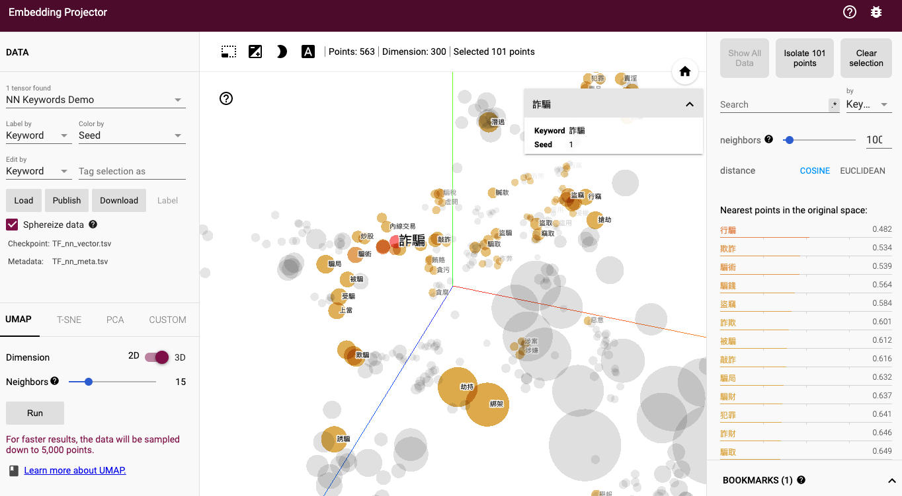

# News Classification for CTBC-INV

### Note:
  本次Release已使用新版擴增之關鍵字清單(詳見: [news_classifier/config_202207.py](news_classifier/config_202207.py))，
  如需使用原本之關鍵字清單，請修改[news_classifier/biznews.py](news_classifier/biznews.py)

  ```python
  from numpy import mat
  # 舊版關鍵字清單 (如需使用舊版，請去除下行註解)
  # from news_classifier import config
  # 202207版關鍵字清單
  from news_classifier import config_202207 as config
  ```


## 標籤規格:
- 新聞正負面：
    - 因為是風控要求，故只需要鎖定負面新聞即可.
    - 不用判斷正面與中性
- ESG新聞：
    - ESG新聞先請投信同仁提供範例
    - 數研發分析後，再設計算法計算ESG之正負面程度

## API開發:
- 開發環境:
    - Windows + python 3.6

## Quick Start:
(1) Init: 
pip install -r requirements.txt

(2) Run example.
python example.py
```bash
$ python example.py
news_samples/dowjones/CHTOTW0020160129ec1u0007d.json 被控掏空公司、詐補助款、買盜伐木 悠活前董座涉詐 獲利上億元
{'NN': True, 'NN_SCORE': 1.0, 'NN_KEYWORDS': ['起訴', '掏空', '不法', '非法', '背信', '挪用', '涉案', '虛報', '詐取', '傷害', '違反', '檢察'], 'ESG': True, 'ESG_SCORE': 1.0, 'ESG_KEYWORDS': ['起訴', '掏空', '不法', '違反', '涉案', '詐欺', '背信']}
news_samples/dowjones/LIBTOT0020170303ed3400056.json 出獄繼續騙 身背7條通緝
{'NN': True, 'NN_SCORE': 1.0, 'NN_KEYWORDS': ['犯罪', '告發', '侵害', '涉嫌', '起訴', '判刑', '判決', '判處', '指控', '控告', '殺害', '被告', '撤銷', '誘騙', '檢察'], 'ESG': True, 'ESG_SCORE': 0.68, 'ESG_KEYWORDS': ['詐欺', '起訴', '侵占', '撤銷', '判決', '判刑']}
news_samples/dowjones/LIBTOT0020190220ef2l0001j.json 愛國同心會長涉賄選 檢不排除有中資
{'NN': True, 'NN_SCORE': 0.77, 'NN_KEYWORDS': ['起訴', '非法', '違反', '不法', '犯罪', '賄賂', '檢舉'], 'ESG': True, 'ESG_SCORE': 0.58, 'ESG_KEYWORDS': ['起訴', '違反', '不法']}
news_samples/dowjones/CTRTOT0020170125ed1p000uw.json 暴力討債炒股審理逾8年 鄒興華16人減刑
{'NN': True, 'NN_SCORE': 1.0, 'NN_KEYWORDS': ['判刑', '判決', '炒股', '上訴', '地下錢莊', '侵害', '起訴', '有罪', '涉案', '被告', '違反', '罰金'], 'ESG': True, 'ESG_SCORE': 0.94, 'ESG_KEYWORDS': ['判決', '判刑', '暴力', '起訴', '違反', '涉案']}
news_samples/dowjones/SINTAO0020140617ea6h00015.json 涉洗錢逾千萬婦保釋
{'NN': True, 'NN_SCORE': 0.82, 'NN_KEYWORDS': ['被告', '黑錢', '洗錢', '刑事'], 'ESG': False, 'ESG_SCORE': 0, 'ESG_KEYWORDS': []}
...
```


(Optional) Run tests.
```bash
$make test
nosetests -v tests
test_absolute_truth_and_meaning (test_basic.BasicTestSuite) ... ok
test_class_init (test_biznews.BasicTestSuite) ... ok
Test the return format of the class. ... ok
test_evaluate (test_biznews.BasicTestSuite) ... ok
test_find_keywords (test_biznews.BasicTestSuite) ... ok

----------------------------------------------------------------------
Ran 5 tests in 0.210s

OK
```

## More Info:
1. 計分方式
    - Score 數值介於 0 ~ 1
      - 0.0: 標題與內文中無包含任何關鍵字
      - 0.5: 命中任一關鍵字，即符合分類標準，至少取得0.5分。詳見下述公式。
      - 1.0: 最大值

    - 新聞標題的權重 > 新聞內文的權重

        舉例來說: title_weight = 0.3, body_weight = 0.1

        

        當新聞標題 (news_title) 出現 p 個關鍵字，新聞內文 (news_body) 出現 q 個關鍵字時，實際上，程式會以  個關鍵詞去計分。

        k 的定義:

        
        
        計分定義 (當關鍵字經過權重調整之後，中了15個字以上，分數為1.0 (最高分)):

        
        
        程式碼詳請可見 `news_classifier::biznews::score_func`

    - 如何調用

        若要改變 title_weight 和 body_weight，可於 NewsReader Class參數配置 。這代表可以針對不同的新聞去做客製化的調配。
        ```
        """ Classify News """
        ## 設定 nn_reader 在判讀這篇新聞時，title_weight=0.7, body_weight=0.3
        nn_reader.title_weight=0.7
        nn_reader.body_weight=0.2
        nn_res = nn_reader.classify(news_title = "xxxx", news_body = "mmmmm")
        ```

2. 關鍵字擴增:

  - 詳見 [expand_keywords.ipynb](expand_keywords.ipynb)
    - Note: 需安裝額外套件，詳見 [requirements-dev.txt](requirements-dev.txt)
    
    
  - 視覺化呈現Demo: 
    - 可安裝tensorboard 或
    - 上傳 vector & meta 檔案至 https://projector.tensorflow.org/
      - [Releases/202207/TF_nn_vector.tsv](Releases/202207/TF_nn_vector.tsv)
      - [Releases/202207/TF_nn_meta.tsv](Releases/202207/TF_nn_meta.tsv)

  